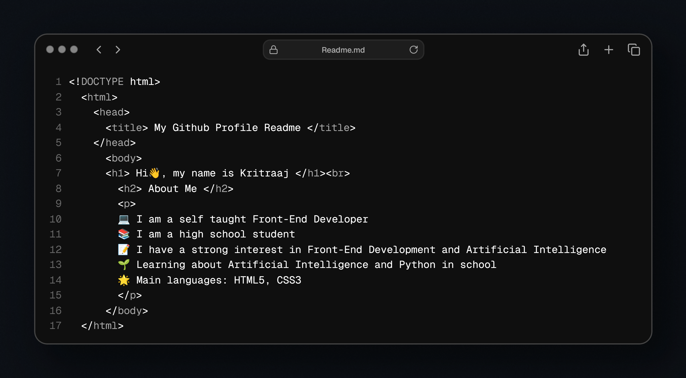
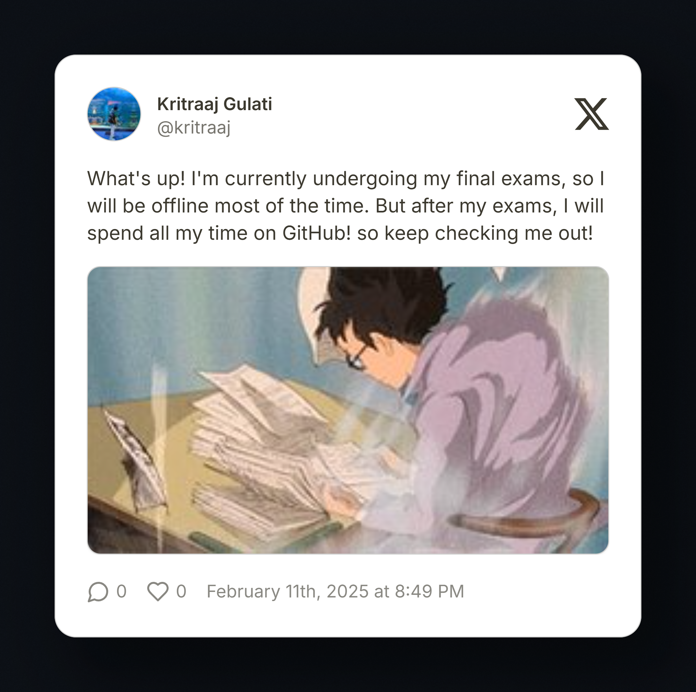

<h1>
  Hi👋, I am Kritraaj
	
	
  
<!-- About Me Section -->
	

<!-- Tech Stack Section -->

  <ul align="center">
    
<h2 style="display: inline-block">Technologies That I Know👨🏻‍💻</h2>

  </ul>

<!--tech stack icons-->

  

<!-- GitHub Stats -->
<h2 align="center">📈 GitHub Statistics</h2>

   
  

  
	

<!-- Trophies -->
<h2 align="center">🏆 GitHub Trophies</h2>

  

<h3> 🗣 Languages </h3>
  
  

<!-- Connect Section -->
<h3 align="center" > Connect with me 🤝 </h3>

 

        
		
		
		
      

      

<!-- Inspirational Quote -->

  

<!-- Snake Animation -->
<picture>
  <source media="(prefers-color-scheme: dark)" srcset="https://raw.githubusercontent.com/kritraaj/kritraaj/output/github-snake-dark.svg" />
  <source media="(prefers-color-scheme: light)" srcset="https://raw.githubusercontent.com/kritraaj/kritraaj/output/github-snake.svg" />
  
</picture>
